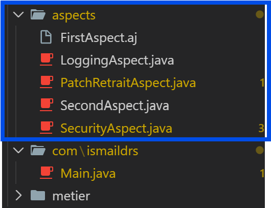

# Aspect-Oriented Programming with AspectJ

## Aspect-Oriented Programming (AOP)

Aspect-Oriented Programming (AOP) is a programming paradigm that aims to increase modularity by allowing the separation of cross-cutting concerns. It does this by adding additional behavior to existing code without modifying the code itself. AOP is particularly useful for handling concerns like logging, security, and transaction management that span multiple parts of an application.

## Project Overview

This project demonstrates AOP using AspectJ. It includes a simple main class that is advised by two aspects: one using native AspectJ syntax and another using annotation-based syntax.

## Aspects

### FirstAspect

FirstAspect is defined in `FirstAspect.aj` using native AspectJ syntax. It advises the `main` method of the `Main` class with before and after advice.

### SecondAspect

SecondAspect is defined in `SecondAspect.java` using annotation-based syntax with `@Aspect`. It also advises the `main` method.

### Logging Aspect

The Logging Aspect handles cross-cutting logging concerns. It can be implemented using either native AspectJ syntax or annotations to log method executions, exceptions, or other events across the application. It logs into a file called "log.xml" using a file logging handler.

### Security Aspect

The Security Aspect manages authentication and authorization concerns.

### Patch Retrait Aspect

The Patch Retrait Aspect handles dynamic code verifications of retrieval in accounts.